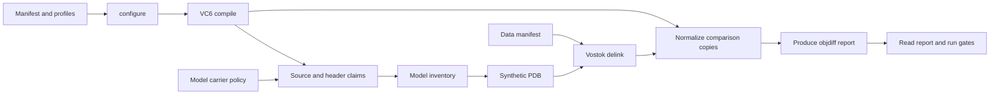

# Tooling data flow and project boundary

The package and CLI retain their HoMM3 names. MSVC/COFF, objdiff, PE32 and
SH4/NB11 knowledge is intentional. Project facts enter through these inputs:

- `config/project.toml`: executable identities and staged paths, expected retail
  image base, toolchain search locations, and reviewed Dreamcast type aliases.
- `config/units.toml`: compilation units, profiles and include search order.
  `build.analysis_profile` explicitly selects the profile for standalone headers
  and reference-only sources with no admitted TU.
- Existing admitted inventories and source annotations: addresses, ownership,
  names and reviewed exceptions. Dreamcast correlation remains a specialist
  analysis; it is not a requirement imposed by the generic type comparator.

`core.project.Project` is an operation-scoped snapshot. Create a new one after a
merge or input edit. An explicit root selects its manifest, staged executables,
Clang header mirror and generated claims. It never borrows these from another
checkout. CLI defaults still use `HOMM3_DIR`; executable and toolchain environment
overrides remain supported. This is not a backend registry or plugin framework.

`core.compiler_profile` translates the unit's MSVC profile for all Clang
consumers: the compilation database, source-fact ASTs, ownership and label IR.
Consumers add only their actions and necessary parsing options. The translator
preserves ABI, language and preprocessor settings, maps `/GX` to `/EHsc`, and
undefines Clang's default `_MT`/`_DLL` for VC6 `/ML`. It discards code generation
switches: Clang still supplies observations, never a matching verdict.

IAT decoration recovery accepts a resolved import-library directory. The model
supplies the same toolchain selection used by compilation. The reader has no
global memo that could survive a toolchain change or file replacement.

Project aliases are opt-in inputs to `type_differences`/`compare_facts`. Ordinary
calls apply only language/MSVC/standard-library normalization. The Dreamcast
source audit supplies that project's reviewed alias scope.

PE layout travels with parsed inputs. NB11 symbols retain image base and section
mapping; SH4 disassembly derives its code/file and literal-pool addresses from
that mapping. Paired relocation normalization, executable diff summaries, link
base defaults and executable queues use the parsed retail base. Source-only
annotation operations can use the expected base admitted in project config,
without requiring game bytes. The image reader checks that assertion when bytes
are used. A different project therefore does not require finding numeric base
literals scattered through these tools.

The build stages have callable interfaces separate from their CLI shims:

Model generation returns the inventory path; PDB generation consumes that path
and returns its artifact. Delinking returns its inventory/PDB/data paths and
produced/missing targets. Normalization returns counters. The focused
`build.refresh` stage returns a `RefreshResult`; sema renders it. Report
production lives in `build.report.generate`; `status.load_report` only reads.
`status.refresh_report` explicitly validates inputs, produces a report and reads
it. Compile/report failures stop the requesting operation with diagnostics.

Header extraction receives a model-owned `CarrierPolicy`. It does not read the
score ledger to invent policy. Existing banked carriers remain when bodies stop
emitting, and all banked TU/RVA inline bindings are retained. Missing bodies stay
measurable rather than disappearing from the comparison universe.

Caches remain content based. Ownership keys include the manifest, project
configuration and compiler-profile implementation. Ninja dependencies include
project/manifest configuration, so changed include search order triggers a
compile. Debug-object cache keys include that search order. Paired normalization
stamps include project input specifications and the implementations that supply
the layout. These are disposable build artifacts, not another source of truth.
