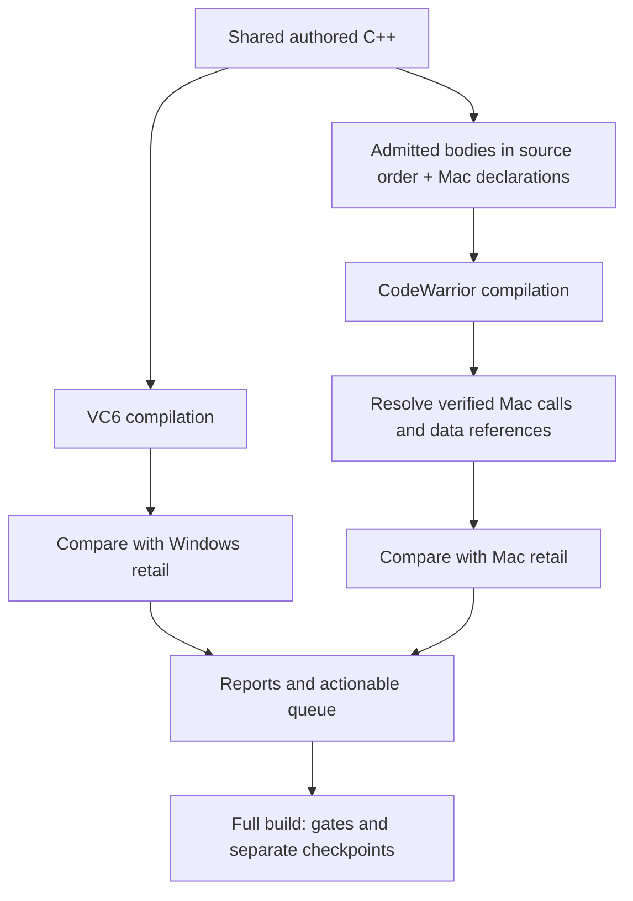

# Mac matching tooling: implementation report

## Current phase

The core dual-target tooling is implemented. Six workers ran the first
matching wave. Each supported function can now be compiled from the shared
authored C++ and compared independently against Windows retail and Mac retail.
The current Mac function manifests contain 64 admitted pairs across the
shared starter manifest and twelve unit manifests. The full build scores all
64: 13 are byte-exact and 53.29% of 57,860 compared bytes match. This is
coverage of selected functions, not a claim about the rest of the Mac
executable. GAME `convertObject` remains a proposal because its
`vector<CObjectType>::push_back` relocation is not yet bound. The action queue
has 506 unfinished tasks, 52 with current comparison evidence.

Eight functions reached Windows exactness in focused work after the Mac target
was introduced:

| Function | Windows focused result | Mac status |
| --- | --- | --- |
| `game::processOnMapTowns` | 100%, 57/57 CFG blocks | Bounded proposal; GAME view incomplete |
| `game::perDay` | 100%, 80/80 CFG blocks | Admitted; 98.98%, 15/15 calls |
| `hero::getLuckDescription` | 100%, 110/110 CFG blocks | Admitted; 90.15%, 64/64 calls |
| `NewfullMap::loadMapObjects` | 100%, 61/61 CFG blocks | Bounded proposal; MAPCELL view incomplete |
| `town::canBuild` | 100%, 15/15 CFG blocks | Admitted; 27.18% with current shared source |
| `recruitUnit::recruitUnit(hero*,...)` | 100%, 6/6 CFG blocks | **Exact, 192/192 bytes** |
| `recruitUnit::recruitUnit(armyGroup*,...)` | 100%, 6/6 CFG blocks | **Exact, 196/196 bytes** |
| `type_skill_quest::doProgressDialog` | 100%, 12/12 CFG blocks | **Exact, 84/84 bytes** |

These are focused observations. The Mac result is a separate verdict for each
admitted pair.

Tooling work continues where newly admitted functions expose unsupported data,
helper or platform requirements. We have a working matching loop, but do not yet
have Mac compilation coverage for every game function or every Windows TU.

The integrated checkpoint below is the successful full build after the first
six-worker matching wave. The function results later in this report retain
their focused evidence and describe how the checkpoint was reached.

## The three executable roles

| Executable | Role | Address identity |
| --- | --- | --- |
| Windows `HEROES3.EXE` | Original exact target, compiled with VC6 SP3 | Existing source `VA(...)`, such as `0x004e51c0` |
| Classic Mac `Heroes_III_raw.pef` | Second exact target, compiled with CodeWarrior | PEF section and offset, such as `mac:0:0x106188` |
| Dreamcast `H3.EXE` | Debug evidence for names, declarations, locals, helpers and source lines | Existing Dreamcast selectors |

The Mac executable is labeled **Classic Mac PowerPC second target**. It is a
Classic Mac OS executable. The Mac address map inherits names from the existing
source annotations: a reviewed pairing connects the Windows VA to a Mac span.
It does not introduce a separate handwritten name ledger.

Mac is now the additional byte target and a direct view of retained helper
calls. Dreamcast remains useful because it contains source information absent
from the stripped Mac executable. Neither target establishes the other's byte
match or erases genuine differences between the ports.

## What was implemented

| Area | Implementation and purpose |
| --- | --- |
| Reproducible inputs | Pin executable and compiler hashes; stage user-supplied inputs under ignored `build/`; use a separate CodeWarrior Wine prefix. README documents all three executables. |
| PEF reader | Decode packed sections, validate bounds, and interpret loader relocations, imports and transition vectors. Mac addresses retain their section identity. |
| Pairing and labels | Require source ownership, a complete Mac span, target hash, emitted symbol and identity/boundary evidence. Reject conflicting or overlapping admissions. |
| Compiler harness | Compile admitted bodies together in authored source order with a per-unit declaration/layout view. Capture header closure, flags and object provenance. |
| Object extraction | Read named CodeWarrior MWOB code/data hunks and their symbolic references. Require real object output from `-nolink`; syntax checking is insufficient. |
| Byte comparison | Resolve supported calls and data references at their verified Mac addresses and reproduce the relevant MWLink transformations before comparing bytes. Unsupported references remain errors. |
| Call comparison | Report retail and candidate counts, direct/indirect calls, named targets, ordering, and added or missing calls. Preserve useful observations even when byte comparison is unavailable. |
| Action queue | Join Windows matching status with Mac coverage, compilation support, reference resolution and current comparison evidence. Produce an explicit next action per unfinished function. |
| Worker packets | Generate disjoint TU packets for six workers, including preparation tasks where pairing or compilation support is missing. |
| Checkpointing | Keep separate Mac and Windows observations and score ledgers. Refuse a partial Mac checkpoint when any admitted pair is unavailable. |

The implementation lives in [scripts/homm3/mac](../../scripts/homm3/mac/), with
reviewed inputs in [config/mac](../../config/mac/).

## What Mac established about inlining

Mac exposed many retained calls to small helpers and helped recover their
boundaries. In particular, SEERHUT's shared dialog helper and KB's
`sendPlayerLost` remain ordinary source helpers: marking them `inline` would
misrepresent the Mac call pattern. These bodies now live in their normal owning
headers. The Mac compiler stages the same marked bodies into its declaration
view; the former extracted `include/inline/` directory was a tooling
organization choice, not evidence of source-level `inline` declarations.
Dreamcast and source evidence establish the declaration spelling;
Mac independently tests whether CodeWarrior retained calls or expanded them.
We have not established a corpus-wide count of newly discovered source-level
inline functions attributable to Mac alone.

## How the normal build works



`homm3 build --fast <TU>` runs both target paths for admitted Mac counterparts
in the selected unit. `homm3 build` performs the integrated checkpoint and
source gates. No second manual compilation command is required for the normal
matching loop.

The VC6 wrapper now stages its object in the output directory and replaces
the previous object only when the compiler produces a new one. A failed Wine
launch therefore leaves the last raw object available for inspection while
Ninja still reports the failed rebuild. A regression case covers failed and
successful publication; it has not been run under the current test deferral.
A subsequent focused TOWN VC6 build succeeded through the staged wrapper.
The source-fragment registry also accepts a canonical `src/*.cpp` owner when
an extracted fragment stays in `include/` and appears through exactly one
literal include at its original source position. This lets GAME share its
Wizard's Well constant definition with the Mac declaration view while
retaining one source initializer and original TU order. The new regression
case is written but remains unrun under the test deferral.

The Mac compilation scope is currently `paired_bodies`: selected canonical
source bodies, explicit source-owned helpers, and compatible shared inline
definitions. A unit view supplies Mac declarations and layouts; it must not
contain a second implementation of a game function. This scope does not yet
compile all Windows platform code into a complete Mac executable.

The calibrated controls use CodeWarrior Pro 6, compiler 2.4 build 0131,
`-O1 -proc 750 -nolink`. Profiles remain per-unit: the controls do not establish
one optimization policy for every function in the game.

The initial source-shape calibration was `hero::getHighestSchool`. The Mac
body matched all 36 instructions after removing a fabricated `else` and
placing `bestLevel` before `bestSchool`; the same recovered source made the
Windows body exact. CodeWarrior retained separate member loads and short
helper calls in that case, which made the source order easier to read. Eight
surrounding-code variants left that Mac body unchanged, but the corresponding
VC6 control was also stable once an intentional class-layout change was
excluded. This is a useful local calibration, not a general guarantee that
either compiler is immune to context changes. A retained Mac helper call is
positive evidence for a source boundary; each Windows call or inline expansion
still needs its own VC6 verdict.

A later MAPCELL -O4 compilation did expose context sensitivity: adding the
source-earlier `TTimedEvent::read` body changed helper inlining in two
previously paired bodies and emitted a candidate-only allocator constructor
and two vector helper calls. Retail expands those operations at the
corresponding sites, so assigning arbitrary retained callee addresses would
be wrong. The bounded `TTimedEvent` body remains a reviewed proposal while
its compiler context is investigated.
It shows why every Mac result carries source-order and profile provenance and
must be refreshed when the compilation group changes.
An isolated source-order probe confirmed the effect: when `TTimedEvent::read`
precedes both controls, their emitted bodies change from 1008/444 to
992/312 bytes and gain vector helper calls; placing it between them changes
only the later control; placing it last restores both. The allocator call in
`TTimedEvent` persists in every order. Authored MAPCELL source defines it
first, so the last-order diagnostic cannot be adopted as a matching profile.

## What an exact result means

An exact Mac verdict requires the entire admitted function-code span and its
reviewed switch tables to agree, with supported reference destinations resolved.
Call operands and switch destinations are part of the comparison. A missing
global or unknown callee prevents an exact verdict.

The resolver models direct branches, reviewed runtime targets, import glue,
function-pointer/virtual-call glue, TOC address loads, and supported MWLink
reload removal and address-load relaxation. Real separately linked controls
check those transformations; they are not inferred solely from a similarity
score.

Two scope distinctions matter:

- **Callee-only references** identify verified source-owned Mac bodies so callers
  can link and name their calls. They do not claim that those callees have been
  compiled or matched, and do not enter the byte-target denominator.
- **Declaration-only data bindings** identify external storage using `DATA`
  annotations and verified loader/TOC evidence. They prove an address binding,
  not a matching candidate initializer. CodeWarrior symbolic exception tables
  are also recorded separately as unscored metadata.

Literal bindings use reviewed payloads and locations, with unit scopes where
identical constants occur in different pools. An unstable compiler-generated
`@number` is never sufficient evidence of identity.
When a candidate loads an anonymous literal through a CodeWarrior TOC pointer
cell, an owner-and-site record checks the emitted payload and pointer-cell
relocation, the exact retail load instruction, and the retail loader pointer
to the pinned payload. This extends the same strict site binding used for
direct TOC loads; its regression case has been written but not run under the
current test deferral.

Function-local switch tables use `[[jump_tables]]` records in the data inventory.
Each record gives `owner_va`, `unit`, the Mac span/hash, and a function-relative
`reference_offset` for the retail TOC load. The loader must prove that this load
selects the table and that every table entry points inside its owning function.
The candidate must have one unambiguous table of that extent, with a 32-bit
relocation to its own function for every entry. Unknown or ambiguous forms remain
unavailable comparisons.

The linker rebases candidate case labels through the same reload-slot removals
as the function's branches, then compares every table byte. It never substitutes
retail labels for candidate labels. `score`, `matching_bytes`, `compared_bytes`
and `exact` cover code plus these tables; `code_score`, `code_matching_bytes` and
`code_exact` expose the code-only result. `size` and `candidate_size` remain code
sizes, and `jump_tables` reports each table separately. The text diff lists any
unequal case destinations. These additions have been exercised on live matching
objects; their regression suite remains deferred at the user's request.

## Call reports and the action list

The requested retail-versus-candidate call report is available both per
function and across all admitted pairs:

```sh
homm3 mac calls 0x004d97f0
homm3 mac calls
homm3 mac queue
homm3 mac queue --unit hero
```

For example, the integrated report records `hero::updateArmies` with 12 retail
calls, 12 candidate calls and agreeing ordered targets, while its Mac byte score
is 97.7431%. That directs investigation toward the remaining instructions.
`buyCreatures` has 22 retail calls and 25 candidate calls, directing attention
to the specific additional helpers and their visibility.

These counts describe static call sites, not runtime execution frequency.
Equal counts alone do not prove equal callees or correct inlining. Indirect
destinations and unresolved identities remain explicit.

| Generated artifact | Contents |
| --- | --- |
| `build/mac/report.json` | Function byte results, failures and provenance |
| `build/mac/calls.json`, `calls.tsv` | Retail/candidate call counts, identities and sequence comparison |
| `build/mac/queue.json`, `queue.tsv` | Actionable tasks, ownership, evidence freshness and next commands |
| `build/mac/campaign.json` | Disjoint worker packets |
| `build/mac/objects/unit-<TU>/compilation.json` | Emitted symbols, code/data/metadata coverage and compilation provenance |

The queue distinguishes missing pairing, missing compilation support,
comparison setup problems, call differences and instruction differences.
An unavailable candidate is never reported as having zero calls or a 0% match.
The deferred `rmg`, `zlib-1.1.3`, `codec` and `victor` modules remain visible as
deferred work and stay out of default dispatch.

## Freshness, ownership and validation

Source, header, profile, compiler, target, object, disassembly and analysis
inputs are tracked so stale results cannot become current matching evidence.
Compilation/report locks and merged unit reports support concurrent workers
without discarding the other units' provenance.

Shared method bodies reside in canonical headers at their original positions.
The [Mac shared-body map](../../config/mac/shared-bodies.toml) points to those
positions; staging extracts the enclosed text for CodeWarrior. The remaining
[fragment registry](../../config/source/header-fragments.toml) covers ordinary
shared headers and retains physical definition and ownership checks.

Validation:

- **174 relevant tests passed at the preceding tooling checkpoint:** 48 Mac
  tests and 126 source ownership/inventory, build and input tests. That suite
  was not rerun for this matching wave.
- Actual CodeWarrior/MWLink controls verify imported calls, function pointers,
  virtual calls, external globals, literal addresses and TOC transformations.
- Named MSL library hunks verify the complete runtime spans for `memcpy`,
  `strcpy` and `sprintf`.
- The current full build passed the Windows and Mac checkpoints, with zero new
  VA-claim violations, zero source splits, zero source-ownership violations,
  zero unresolved source-inventory entries and no cleanliness ratchet rise.

## Integrated snapshot and remaining work

| Measure | Current full-build result |
| --- | --- |
| Windows internal unit ledger | 4,287 / 4,779 exact MAX; 97.05% weighted MAX |
| Windows public executable inventory | 4,274 / 4,766 exact MAX |
| Mac admitted byte targets | 64; all scored, 13 exact |
| Mac compared bytes | 53.29% of 57,860 bytes match |
| Mac unavailable comparisons | 0 |
| Queue | 506 tasks; 52 with current comparison evidence |

The Windows figures use different internal/public inventories; they are not
competing totals. Mac coverage is still a small admitted subset of the game.

The initial five-pair tooling checkpoint and the later 18-pair trial exposed
missing Mac reference bindings. Those failures were repaired or kept as
unadmitted proposals. The current 64-pair build banks a complete checkpoint;
README now reports 13 exact functions out of 64.

Concrete work discovered by the expanded campaign:

Subsequent focused matching added TU-static and class-static data support,
canonical helper references without Windows VAs, and reviewed code-section
literals and named const arrays. Actual Mac comparisons now run for
`getTurnAIVars` and `doBestPurchase`. The test count above belongs to the
earlier tooling checkpoint; the current full build reran the integrated gates.

The ResourceManager lane independently bounded and SHA-verified CodeWarrior's
scalar and array `new`/`delete` runtime bodies in the pinned PEF. The array
wrappers at 0:0x268c14 and 0:0x268c34 delegate to the scalar bodies and let
`getSprite` resolve its allocation calls. The Mac target expands `addPal16`
and `addPal24` in place; qualifying those same canonical helpers `inline`
also lets the candidate link and produces the first official Mac byte/call
verdict. The candidate is 1184 versus 1560 target bytes, with 45 versus 52
calls and 10.38% byte agreement. The main call gap is a Mac resource buffer
that allocates and locks classic Mac handles, while current source uses raw
arrays. Its original type name is not yet established, so the call report
keeps that port difference explicit.

The Mac source extractor now recognizes a VA marker on a later function
declaration, preserves that declaration at its original source position and
compiles the unique earlier definition through `source_helpers`. The paired
function's own source hash includes that definition, so a body edit cannot
inherit an obsolete MAX. A regression case was added; the user deferred its
execution with the rest of the test suite.

`combatManager::doCompAI` is exact on both targets after restoring the
Dreamcast supported nested `else if`: Windows has 9/9 exact CFG blocks and
5/5 calls, and Mac matches all 272 bytes with the same five calls. The
`chooseBallistaTarget` source-scope correction kept Windows at 99.89% and
raised Mac to 97.56% (921/944 bytes); its remaining differences are local
homes and second-scan registers, with ordered calls intact.

`chooseMeleeTarget` has a reviewed Mac body at 0:0x23724..0x242d4. All 30
direct Mac call destinations resolve and align, including the three retained
`moveToward` sites. Its candidate is 3000 versus 2992 retail bytes and matches
601 candidate bytes (20.03%); differences begin in prologue/register layout.
The focused AI rebuild succeeded. Windows remains 97.08% with 164/166
aligned CFG blocks, 28 aligned calls, one retail-only final `moveToward` call,
and 9 versus 10 returns. A final-flag operand-order probe
and an array declaration-order probe were rejected after their comparisons;
no source change was kept solely for a score gain.

The `philAI::moveHero` Mac pair now has equal 884-byte bodies and 21 ordered
calls at matching offsets. Writing the source dimension product in the Mac
retail order raised its byte agreement from 95.25% to 98.08% (867/884),
while an earlier focused VC6 build kept Windows at 97.03%. A subsequent
Dreamcast-supported named cell local in `markShipyards` made the Windows
bitfield store match retail directly. The current Windows byte score is
95.88% because the shorter expansion shifts later bytes, but CFG alignment
improved to 79/79 blocks (78 exact, one size-only) with all 49 branches and
32 calls aligned. The sole size block is `clearShipyards`' address mode:
candidate adds `0xc` to the cell pointer before clearing the flag, while
retail clears at `[eax+0xc]`. Naming the cell in both helpers removed that
size block but changed an unrelated tail call, so the mark-only source model
is retained. Four call-label differences name `vector<army*>::size` versus
the source-proven `vector<type_point>::size` at identical sites; changing
that source type would contradict the shipyard field evidence. The Mac pair
remains 98.08% with 21/21 calls.

`hero::giveExperience` needed an evidenced Mac signature difference: its Mac
symbol takes a third `int`, while Windows and Dreamcast take an unsigned byte.
The Mac target also retains `hero::getLevel` as a call, while Windows expands
its canonical body. A narrow conditional declaration and a low-byte test
raised Mac from 11.41% to 95.71% (379/396 bytes), with all 11 calls aligned
and six other exact Hero Mac controls preserved. Windows remains 97.66% with
10/10 calls; its residual begins at an inlined experience-cap assignment.

`attemptTeleport` is paired through its later Windows VA redeclaration and
earlier canonical source definition. The Mac body at 0:0x340a4 has all nine
reviewed calls and data identities resolved. Its first byte comparison is
30.28%, with a 1420-byte candidate versus 1396-byte retail body and a
different stack frame. Windows remains 99.98% with 63/63 exact CFG blocks;
the effective threshold-table address agrees despite a different COFF
symbol/addend representation.

`philAI::getTurnAIVars` uses a Mac arithmetic form independently supported by
the Mac target and Dreamcast: it forms the difficulty quarter once, subtracts
it for the computer share, then adds it for the human share. Mac rose from
79.76% to 88.70% with equal 416-byte bodies and both calls aligned. A
focused PHILAI restore build confirms Windows stays 97.87%; a named numerator
probe was flat there and worsened Mac, so the direct quotient remains.

The game lane admitted `loadMinePool` at Mac code 0:0xcb404..0xcb6a8 and
resolved its vector resize and three `armyGroup` calls. All 13 retail and
candidate calls agree in order. Dreamcast records a separate unsigned byte
buffer; restoring it and the Mac-evidenced two legacy guard byte locals raised
the Mac result from 26.91% to 96.89% (655/676 bytes) without changing the
676-byte linked length. The remaining 21 byte differences are the stack-frame
size and local stack offsets. Keeping the Windows count in its original `int`
slot and loading both legacy guard bytes after their reads raised Windows to
99.979485%, with 25/25 CFG blocks and all 18 calls aligned. Raw COFF bytes show
only the two guard locals occupying opposite stack slots. A two-byte array
regressed Windows to 98.87% and was reverted. A later focused `game` build
confirmed the restored 99.98% Windows and 96.89% Mac results; no full
checkpoint or test suite was run.

The same lane admitted `getNewHeroId` at Mac code 0:0xce398..0xceb24
(1932 bytes) after independently checking its two weighted `random` calls,
18-class arrays, Conflux restrictions, and final 156-hero scan. The declaration
view now models the packed Mac hero stride and the game fields used by that
body. All five target calls resolve to the same ordered `bzero`, bitset test,
and `random` callees in the candidate. Initial Mac comparison was 405/1932
bytes (20.96%). Restoring Dreamcast's typed `THeroClass` induction local and
explicit enum advancement raised it to 533/1932 bytes (27.59%), with all five
Mac calls still aligned. A focused VC6 build confirmed Windows remains 98.98%,
with exact 60/60 CFG blocks and four ordered calls. Both targets still differ
in register/local layout. CodeWarrior O2 worsened Mac agreement to 10.30%,
while O3 and O4 were equal before the enum edit; swapping array declarations
was byte-flat in that earlier source model. CodeWarrior's MSL bitset header
confirms that nonconst `operator[]` constructs a two-word reference before
calling `test`. Restoring indexing at both pool-map sites raises Mac to
539/1932 bytes (27.90%) and leaves Windows at 98.98% with its exact CFG and
call sequence. The Mac candidate still has a different loop induction and
register allocation, so this source-backed correction is retained without
claiming an exact match.

## Subsequent focused matching wave

`game::processOnMapTowns` is now Windows 100% (57/57 CFG blocks, 31 branches,
18/18 calls). The authored town-name table had a 17-pointer faction stride,
while retail indexes it with a 16-pointer stride. The independent
`initializeTownNameText` declaration and loop also use 16; correcting the
GAME declaration removed the extra index arithmetic. A focused GAME build
exited successfully with all three previously admitted Mac comparisons
available. Mac `processOnMapTowns` was independently bounded at
0:0xe2024..0xe21e0, with the same 16-pointer table and ordered town/map
operations. Its reviewed proposal remains in ignored `build/mac/pairing/`
until the broader GAME declaration view can compile that body.

`game::perDay` is now Windows 100% (80/80 exact CFG blocks, 41 branches,
18/18 calls), up from 96.23%. Dreamcast passes the town owner directly to
`isHumanAlly`; that canonical helper maps the player to a team. The earlier
caller also mapped the player, so its candidate looked up the team twice,
while retail performs one lookup. Removing the duplicate lookup closed the
whole Windows body in a focused GAME build. Remaining relocation-name rows
refer to source-renamed globals at their annotated retail addresses, including
`g_game`/`gpGame`, `g_bitNumber`/`bitNumber` and `g_resources`. The Mac body
is independently bounded at 0:0xde818..0xdeefc (1764 bytes) by its day/week
updates, 7/4 rollover checks, town loop, globals and sole turn-dispatcher
caller. The pair is admitted and the GAME Mac view now compiles a named
candidate body. The source-owned four-byte `g_resources` table is verified
through its emitted RO hunk and the retail loader/TOC pointer. The canonical
Wizard's Well constant is shared at its original `game.cpp` position through
one source fragment, so its target immediate 0x8a no longer needs a false
external binding. The first Mac call report had 15 retail versus 28
candidate calls and stopped at `vector<town>::operator[]`. Isolated O4
output was byte-identical to O3; auto/deferred inlining left perDay's calls
unchanged and damaged all three GAME controls, so O3 remains. The decisive
fix was guarding two existing VC6 inline-depth pragmas from CodeWarrior;
the Mac view then emits the target's 15 calls in exact order. Reviewed
callee references and all four source data/TOC identities resolve. The
official pair now has equal 1764-byte bodies and scores 97.22%
(1715/1764 bytes), first differing at +0x27. The Mac view's
`m_playerDisabled` byte was then corrected to the target's signed field;
the candidate emits `extsb.` and rises to 97.39% (1718/1764 bytes), with
the same 15 calls and body size. A focused GAME VC6 build
confirmed the guarded perDay remains Windows exact at 1122 bytes; the other
GAME Mac controls retained their prior focused results. Spelling the town
loop's zero store before its decrement, consistent with Dreamcast lines
8124/8126 and Mac retail block order, raises Mac again to 98.98%
(1746/1764 bytes), still with 15/15 calls and equal size. Focused VC6
validation confirmed Windows remains **100%** at 1122 bytes after that
shared-source loop edit. Dreamcast-typed array references for production and
resources, a distinct `townId` loop local, and two `hero&` locals preserve
that Windows exact result and the Mac 98.98% result in a subsequent focused
GAME build. All four admitted GAME Mac comparisons remained available. The
remaining 18 Mac byte differences are confined to frame size, floating-point
scratch stack displacements and the epilogue; all 15 calls still agree.

The Dreamcast-recorded `philAI::buyArtifacts` loop tail was restored as a
`do/while`. Its Mac candidate now has the retail 264-byte length, all five
calls aligned, and 95.45% byte agreement, up from 73.11%. Windows remains
98.13%, with 15/15 CFG blocks and 8/8 calls. A focused PHILAI build passed.

The AI_PLAYER lane admitted `valueOfHiring` at Mac code 0:0x35070..0x357e0.
Its Mac view now uses the canonical searchArray::getCell body and CodeWarrior
MSL pointer-vector push_back expansion. Reviewed retained library constructors,
accessors, reserve and destructor spans were added to `runtime.toml`; their
whole-span hashes were checked against the pinned PEF. Windows remains 99.95%
with 56/56 CFG blocks and 20 ordered calls. Restoring the installed MSL's
`vector` → `__vector_imp` → `__vector_pod` default-constructor layer in the
Mac declaration view emitted the missing pointer-vector constructor. A
reviewed four-byte `compressed_pair::second` runtime alias resolved the
wrapper calls against the same exact pinned accessor body. Mac now has 22/22
ordered calls and scores 686/1904 bytes (36.03%), with an 1848-byte candidate.
The prior 37.92% byte score dipped, but the corrected call boundary is
source-backed and the other six AI_PLAYER Mac controls retained their reported
results, including exact `getSwapValue`.

The HERO initializer exposed a Mac linker ambiguity: five separate CodeWarrior
anonymous constants all contain one zero byte, so payload-only pairing cannot
identify their target TOC slots. The Mac data inventory now accepts a
function-owned candidate reference offset paired with a checked retail TOC
load offset. The linker verifies the candidate's emitted payload, both sites,
the target instruction and the pinned PEF address before resolving it. Direct
byte loads through the TOC are supported. This enabled the first real
`hero::initialize(short)` Mac comparison: 270/1384 bytes (19.51%), equal 11/11
ordered direct calls, and a 1380-byte candidate. Its low byte score is a
source-shape lead, not a linker failure; Windows matching remains in progress.

The MAPCELL lane admitted `NewfullMap::newfullMapFn005042C0` at Mac code
0:0x1270c0..0x127278 after bounding its vector clear, object scan and two
callers. A reviewed MSL `std::string::compare` call resolved the only direct
call. The per-TU CodeWarrior O4 profile raises its Mac result from 83.18% to
94.77% with equal 440-byte bodies and the one call aligned; Windows remains
99.88535%. The residual is register and stack layout, so no unsupported C++
edit was adopted.

`NewfullMap::loadMapObjects` reached Windows 100% in a focused build after
its loop induction variable was restored from unsigned `i` to the
Dreamcast-typed signed `int x`. All 61 CFG blocks, calls and relocations
agree, with no masked instruction differences. Its Mac counterpart is
independently bounded at 0:0x1277f0..0x127a98 (680 bytes) by its object
read, 0x38-byte type loop, sprite-copy operations and adjacent function
boundaries. The MAPCELL declaration view lacks its sprite, path-cell and
resource-manager types, so the pair remains unadmitted and this is not yet a
dual-target exact result.

`NewfullMap::readMonsterData` has an admitted Mac span at
0:0x123b10..0x123eec. Its canonical source now keeps the two typed byte
locals identified by Dreamcast, raising Windows from 97.29% to 97.33% in a
focused build. Mac rose from 24.90% to 64.07% with 19/19 ordered calls after
the Mac source path reproduced its byte-swapped serialized reads, the
declaration view matched the PowerPC bitfield order, and an unsigned Mac
quantity reproduced the target's `lhbrx; sth; lhz` sequence. A
Dreamcast/Mac-supported switch input correction was byte-flat on Windows,
which remains 97.33%. The declaration view also now passes the stack allocator
argument at the Mac `std::string` constructor call. A reviewed alias of that
compiler-generated MSL symbol binds the same pinned runtime body; the Mac
candidate is 972 versus 988 retail bytes. Windows's remaining 47-versus-48
CFG-block difference is classified as an inliner wall.

`recruitUnit::update` now has a verified Mac pair at 0:0x14f46c..0x14fa38.
Source-owned palette storage and the retained MSL vector accessor resolve its
Mac references. Both sides have 33 calls: 25 direct calls agree in order,
while eight indirect destinations remain unknown. A per-unit CodeWarrior O2
profile improved the candidate from the initial 19.58% to 58.22%; candidate
and retail are both 1484 bytes. Windows remains 99.989845%, with one
multiplication operand-load order difference; reversing the C++ operands was
byte-flat and was restored.

`TRecruitWindow`'s constructor now uses four Dreamcast-named
`TTextResource::operator[]` calls in place of direct `getText` spelling.
This was byte-flat on Windows at 99.01016% but closed its Dreamcast audit
findings without moving the exact `recruitUnit` constructors. Its Mac body
is independently bounded at 0:0x14d310..0x14eb7c; the window declaration
view cannot yet compile that 6252-byte body, so its pairing remains a
proposal. The adjacent `addCreatureWidgets` body is also bounded at
0:0x14ec28..0x14eec8.

The RECRUIT hero constructor is exact on both targets after ordering its member
stores as Dreamcast line records and the independently bounded Mac body do:
type, view and town flags, hero and group pointers, creature values, then the
four array pointers. Windows has 6/6 exact CFG blocks and 2/2 calls; the
admitted Mac body at 0:0x15087c..0x15093c matches all 192 bytes and three
direct calls. A reviewed external vtable binding verifies the sole emitted
TOC cell against the pinned 20-byte Mac table, RTTI/zero entries and three
function descriptors; no retail initializer is substituted for candidate
data. The source-owned `g_timers` storage resolves its remaining reference.

The RECRUIT army-group constructor is exact on both targets after its stores
were reordered according to Dreamcast and the independently bounded Mac body
at 0:0x1507b8..0x15087c. Its 257-byte Windows span rose from 97.98% to 100%,
with 6/6 CFG blocks and both calls aligned. The admitted Mac span matches all
196 bytes with all three direct calls aligned. The same reviewed external
vtable binding covers both constructors; the hero-constructor Mac control
remains exact.

`showCreatureRewards` has a bounded TOWN Mac pair at
0:0x1b5970..0x1b5b90. Its first candidate matches 125/544 bytes (22.98%)
with 540 candidate bytes. Both sides have 19 direct calls; one lookup uses
different, byte-identical vector accessor instantiations at distinct Mac
addresses. Windows remains 99.06%, with the known hidden-return-slot setup
order residual. These are scored counterparts, not exact Mac matches.

`town::initializeSpells` initially rose from Windows 82.46% to 99.96212%
after restoring the canonical `hasBuilding` and `setSpellsAvailable` calls
and a natural bitset proxy assignment. The admitted Mac body is at
0:0x1b3abc..0x1b3d54. Restoring the second Dreamcast-supported guild-loop
proxy raised Mac from 18.52% to 21.54%. Assigning the guild level to its
canonical signed-char field without an unsigned cast reproduced the Mac
`extsb` before the store and raised the comparison to 21.84%, with a
660-byte candidate versus 664-byte retail span and all ten ordered calls
aligned. The focused Windows
result dipped to 98.09%, with 54 versus 56 CFG blocks and one extra `_Tidy`
call from the proxy temporary. The eight previously aligned calls remain.
This supported source model is retained while the worker investigates the
remaining loop and temporary-lifetime differences. The nested `_Tidy` sits
one byte above VC6's observed inlining budget (72 against 71). A counted-loop
Mac probe regressed the comparison and was reverted.

`town::buildBuilding` now passes the town owner directly to the canonical
`game::isHumanAlly` helper, as Dreamcast line 1352 and the Mac retail body
show. The previous caller pre-mapped the owner to a team even though the
helper performs that mapping, changing the semantics and compiled control
flow. A focused Windows build raised the score from 96.70% to 99.58%, with
72/72 exact CFG blocks, 45/45 branches and 18/18 named calls aligned. Its
Mac body is independently bounded and admitted at 0:0x1b43ac..0x1b47cc.
The first candidate scored 40.86% (1072 versus 1056 retail bytes), with
all 14 named calls and four data references resolved. A Dreamcast-supported
`builtThisTurn` condition made Mac rise to 75.66%; spelling two separate
artifact/Grail tests as independent `if` statements raised the combined Mac
probe to 92.99%, with the exact 1056-byte body size. Focused VC6 showed the
combined spelling lowered Windows from 99.58% to 91.59% and added one call.
Isolating the two facts identified the owner-assignment branch as the
Windows conflict. Restoring that branch while keeping the independent Tower
test recovered Windows 99.58% with 72/72 CFG blocks and 18/18 calls. The
retained Mac pair currently scores 39.98% with 14/14 calls. The Mac-positive
combined probe remains a documented port/compiler lead, not the shared source.

`town::canBuild` is now Windows 100% in a focused build after restoring the
four Dreamcast-named helpers `townAlreadyBuiltOn`, `isLegalBuilding`,
`canBuildDock` and `getBuildingMask`, plus the typed `buildingMask` local.
Mac retail independently retains the legal-building and dock helper calls.
Its body is bounded and admitted at 0:0x1b67f8..0x1b6994. The TOWN Mac
declaration view now compiles it with all three retained calls and three data
references resolved. The retained Windows-exact source scores 27.18% on Mac
with a 400-byte candidate versus 412-byte retail body. A Dreamcast-backed
early-return spelling raised Mac to 75.00%, but cut Windows to 78.75% and
changed its exact 15-block CFG, so it was reverted. This is a scored second
target with evidence of a real port or compiler-source divergence, not yet an
exact Mac result.

The HERO initializer's five `std::fill_n` byte clears raised Windows from
92.81% to 95.87% in a focused build, with 40/40 aligned CFG blocks (39 exact,
one size-only) and 10/10 ordered calls. Mac keeps 11/11 ordered calls. A
natural empty-string literal kept Windows byte-identical at 95.87% and raised
Mac from 19.51% to 25.65% (355/1384 bytes), moving the first difference to
the artifact fill loop at +0x80. Both uses of that literal are separately
pinned to retail TOC instructions. The six other admitted HERO Mac controls
remain exact in the focused build.

`hero::getMoraleDescription` now uses the Dreamcast-named `town::HasBuilding`
and `TTextResource::operator[]` source calls. The focused Windows result is
92.03%, with 118 versus 109 CFG blocks and 47 versus 45 calls; the text
wrapper change was byte-flat. The Dreamcast audit now has no review findings
for this function. Its Mac body has been independently bounded and admitted
at 0:0xf88cc..0xf8ea8. An explicit LF byte in the shared Grail format
string reproduces the Mac literal; Windows remained byte-flat in a focused
compile. The literal's indirect TOC load and `g_moraleTexts` storage now
resolve. Guarding the existing VC6-only inline pragmas exposed the Mac
retail vector accessor. A pinned MSL non-POD vector `data()` view correction
then raised this Mac body from 79.07% to 90.07% (1351/1500 bytes), with a
1492-byte candidate. Restoring Dreamcast's `morale += 500` and the natural
repeated-difference tail made the complete Mac body **exact: 1500/1500
bytes with 64/64 calls**. A focused HERO VC6 build passed; Windows remained
byte-flat at 92.03%, with its existing 118/109 CFG and call differences.
This is a Mac exact match, not a dual-target exact closure.

Exposing the pinned MSL vector forwarding bodies at -O1 did not eliminate
that wrapper call. An isolated -O3 diagnostic also retained it while changing
four of six exact HERO control objects, so the admitted -O1 profile and its
declaration view were restored.

The adjacent `hero::getLuckDescription` rose from Windows 83.81% to 100%
after restoring the Dreamcast-named `TTextResource::operator[]` and
`town::hasBuilding` calls and spelling the Mac-confirmed format newline as
an explicit LF byte. Its focused VC6 result has 110/110 exact CFG blocks,
51/51 named calls and no instruction differences; Dreamcast audit findings
are zero. The Mac body is independently bounded and admitted at
0:0xf8ea8..0xf947c. The Mac view now compiles and scores 79.09%
(1180/1492 bytes) initially, with all 64 direct calls agreeing in order and six exact
HERO controls unchanged. Guarding existing VC6 inline-depth pragmas so
CodeWarrior does not see them exposed the canonical text accessor. A reviewed
16-byte MSL `vector<char*>::operator[]` runtime body and Mac allocator
constructor semantics then resolved the retained calls. Independent `-inline`
levels 2 and 8 at -O1 did not change the earlier wrapper boundary; -O3
retained it and broke four controls. The Dreamcast-supported `luck += 500`
kept Windows exact (110/110 CFG, 51/51 calls) and raised Mac slightly. A
Mac-view correction for the installed MSL non-POD vector indexer's `data()`
reference-returning path then raised Mac to 90.15% (1345/1492 bytes), with a
1484-byte candidate and all 64 calls still aligned. Repeating the final
effective-luck difference at its comparison and two `abs` uses produced an
exact Mac probe (1492/1492 bytes), but focused VC6 fell from Windows 100% to
91.88% and changed its calls. That probe was rejected. A focused restore
returned Windows to **100%** (110/110 CFG, 51/51 calls); the retained Mac
result is **90.15%** with 64/64 calls. Dreamcast audits report no review
findings for either description; one tracked-bonus local remains outside
audit coverage. Six prior exact HERO Mac controls remained exact.

`aiPlayer::getSwapValue` is already exact on both targets in the current
source: Windows matches 264/264 bytes with 15/15 CFG blocks and seven calls;
Mac matches 412/412 bytes with six calls. Its older nonexact baseline was
stale, so it needs no source rewrite.

KB `displayVCWinLoss` now has a scored Mac pair at
0:0x113208..0x114754, including its reviewed 14-entry switch table. Adding
an explicit `case -1` reproduces the Dreamcast/Mac `type+1` dispatch prelude,
14-entry table shape and 56-byte table extent. Windows remains 97.38% with
237/237 CFG blocks and the same 57-call pattern. The first Mac result is
18.92% across 5508 compared code/table bytes with equal call counts; four
vector accessor call identities differ. The setter's separate `%d` literal
binding lets its Mac pair score 51.20% with 105/105 calls.

KB `displayLCWinLoss` now keeps `sendPlayerLost` as an ordinary canonical
helper. Dreamcast emits the standalone body and Mac retains its three calls;
CodeWarrior also emits those calls from the shared source once the false
`inline` qualifier is removed. Windows remains 79.11% with 46/46 CFG blocks;
its two missing constructor calls are a separate inliner question. The
admitted Mac dispatcher scores 43.28%, with 16/16 calls and a 940-byte
candidate versus 952-byte retail span. The remaining call identities differ
at two hero-message string lookups (`begin` versus `operator[]`); the other
text lookups agree. The helper is a callee reference, outside the byte-target
denominator.

`aiPlayer::aiGetValueOfArtifact` improved from Windows 92.05% to 92.76% by
restoring Dreamcast's `hero::getSecondarySkill` and by-value `max(int,int)`
calls in the two first-aid arms. The audit findings for those calls are now
closed. Its Mac body is bounded at 0:0x3879c..0x38bc4 and shows the same
skill-byte and by-value maximum operations, but the current Mac declaration
view cannot compile its artifact types; it remains reference-only.

`aiPlayer::purchaseBuilding` now uses the Dreamcast-named
`game::townAlreadyBuiltOn` and `town::hasBuilding` helpers at all three
reviewed sites. A focused Windows build raised it from 84.31% to 84.78%,
with exact CFG blocks rising from 8 to 30 out of 102; Dreamcast audit
findings fell to zero. The independently located Mac body at
0:0x2ed58..0x2f178 expands those same checks. A temporary evidence-backed
Mac view compiles the canonical 1144-byte caller, but four earlier same-TU
static helpers (`valueOfBuilding`, `getRequirements`, `getFullCost`,
`markValues`) lack complete projected bodies and references. The pair remains
unadmitted, with a reviewed ignored proposal rather than a false call or byte
verdict.

`aiPlayer::netValueOfLocation` now spells the Dreamcast-proven
`type_point::operator!=` call at its monster-position check. A focused
Windows build stayed byte-flat at 85.35%, with 36/36 CFG blocks, 20/20
branches and 7/7 calls aligned, while the audit finding closed. Its Mac
counterpart is not admitted because the current AI_PLAYER declaration view
lacks six canonical dependencies used by that body.

`aiPlayer::markDestinations` now uses the two Dreamcast-proven nested
`getLocation()` calls. A focused VC6 compile raised Windows from 91.17% to
92.19%; all 30 CFG blocks, 14 branches and nine ordered calls remain aligned.
The remaining difference is register allocation and three size-only blocks.
Its Mac view lacks the search-array methods needed for a scored pair.

`aiCheckRetreat` now uses an explicit early `return 0` supported by
Dreamcast lines 164–165 and Mac retail. Windows stayed at 94.51% with all
78 CFG blocks, 54 branches and 12 calls aligned; Mac rose from 13.66% to
15.05% with all nine calls aligned. The remaining Windows difference is
register selection, with no source-backed declaration-order correction from
the one-shot diagnostic.

`combatManager::chooseBallistaTarget` now reuses one loop counter in its two
scans, consistent with Dreamcast's shared index register. Mac improved from
97.56% to 97.99% (925/944 bytes) with all 14 calls aligned and an unchanged
body size. A focused VC6 build kept Windows at 99.89% with all 40 CFG blocks,
27 branches and 16 calls aligned; its remaining difference is a stack-home
byte. The Mac residual is a second-scan army-pointer register choice, with
no further source-backed edit adopted.

`combatManager::sodChooseFaerieDragonSpell` has a reviewed Mac body at
0:0x22e64..0x22f94, located through its sole caller, four ordered spell and
caster calls, loop bound, grid arithmetic and army fields. The shared
canonical `gridX` and `inInvisibleColumn` inline bodies were exposed through
their original `cmbtmgr.h` positions for the Mac view. The pair is admitted
and scores 95.07% (289/304 bytes), with 4/4 Mac calls aligned and equal
304-byte linked code spans after supported linker transforms. A focused AI
build after the shared-header extraction passed;
Windows stays at 94.52%, Ballista at 99.89%, and prior exact AI bodies stay
exact. Placing `bestValue = value` before `bestHex = hex` follows the Mac
retail store order and raises Mac to 97.70% (297/304 bytes); a focused VC6
build left Windows byte-flat at 94.52% with exact 13/13 CFG blocks and four
calls. The remaining Mac differences are caster frame and stack offsets,
with no supported source correction yet.

The ADVMGR `setHeroContext` Mac counterpart is independently bounded at
0:0x18220..0x187b4. An evidence-backed -O3 declaration view now compiles
the canonical source as a named 1792-byte CodeWarrior body with 55 references.
Six source DATA bindings are pinned through reviewed Mac TOC pointers.
Restoring the canonical `deactivateCurrTown`, `hideRoute` and
`deactivateCurrHero` calls at the top of the body aligns their first three
Mac calls with the target and shrinks the named candidate to 1696 bytes.
The focused ADVMGR build leaves Windows byte-flat at 99.2746%, with 80/80
CFG blocks and 39 calls. Later candidate calls still differ from Mac retail
and remain unresolved, so the pair is an ignored proposal without a linked
byte score.

`advManager::screenScroll` is independently bounded at Mac
0:0x19c48..0x19e50 (520 bytes). Restoring the Dreamcast and Mac supported
`updateRadar`, `completeDraw` and `updateScreen` calls leaves Windows
97.8177% with 34/34 exact CFG blocks and nine agreeing calls in a focused
ADVMGR build. The current Mac candidate is 504 bytes with one extra `limit`
call from an incomplete inline declaration view; the pair remains a proposal
until that view and its references resolve.

An independent GAME `convertObject` Mac body resolved the order of two
previously ambiguous map-dimension data bindings. Its outer y/vertical
comparison reads Mac storage 1+0x432f8, identifying height; the inner
x/horizontal comparison reads 1+0x432f4, identifying width. The PHILAI
address-only rows had inferred the opposite order from a width-times-height
product whose two initial values are both 72. Their Mac addresses and
evidence have been corrected. Its GAME pair remains a proposal at
0:0xe0be8..0xe1030 and the minimal view emits a 1040-byte named body with
24 references. The official comparison stops at an independently identified
but unbound `vector<CObjectType>::push_back` call, so no Mac byte score is
claimed. Windows remains 99.9756%, with 44/44 CFG blocks and one addressing
operand-order difference inside an inlined string helper.

`game::setupNewOverviewType` is independently bounded in Mac code at
0:0x135d54..0x136128 (980 bytes). Its canonical body compiles through a
minimal OVERVIEW view at -O3 to 1048 bytes, with title tables and the
`getLocalPlayer` callee independently pinned. A linked byte score is not
available: eight same-unit uninitialized storage objects include pointers
and arrays whose direct Mac TOC accesses cannot yet be modeled honestly.
The pair and data coordinates remain ignored proposals; Windows is unchanged
at 96.4609%, with 29/29 CFG blocks and 17/17 calls.

`TSellCreatureWindow::update` has a reviewed, ignored Mac proposal at
0:0x1f7964..0x1f8144 (2016 bytes). The canonical source compiles to a
2164-byte Mac body and both sides have 63 direct calls, but one branch calls
`setWidgetOff` four times on Mac where the Windows source calls
`setWidgetDisabled`. The helper bodies distinguish their message codes, so
the branch is a genuine port difference. Windows stays 98.7522%, with
52/52 CFG blocks and 57 agreeing calls; no Mac byte score is claimed.

The HISCORE `THighScoreWindow` constructor is independently bounded at
0:0x10b084..0x10b708 by its modal caller, adjacent destructor, four button
strings, backgrounds, vtable and complete span hash. A minimal Mac view
compiles the canonical body as a named 1388-byte MWOB hunk with 46 references.
It is still a proposal: the view lacks canonical inline widget methods and
the installed MSL pointer-vector hierarchy, while Mac retail calls a
combined high-score image helper with no identified source owner. The
button/icon constructors, addWidget and data TOC identities also need
review. No Mac byte score is claimed for this unadmitted body.

`TCampaignBrief::updateAllyEnemyFlags` is admitted at Mac code
0:0x64584..0x64720. The official comparison scores 66.99% (276/412 bytes):
all 13 direct calls and both TOC data references resolve, with one expected
virtual dispatch whose target remains indirect. The Mac selected-body view
uses an external declaration for the source-owned player-slot static because
the retained code accesses it through an indirect TOC entry; modeling the
selected body as a same-unit definition emitted a different access sequence.
The focused CAMPAIGNBRIEF build passed, and Windows remains 99.8958% with
9/9 exact CFG blocks and agreeing calls. No C++ body edit was made for this
pair.

`TCampaignBrief::select` has an independently bounded Mac proposal at
0:0x63db4..0x64044 (656 bytes), supported by Dreamcast's recorded source
layout and helper calls. Its selected-body view compiles, but retail reads a
same-unit uninitialized byte through a direct TOC entry that the current
zero-storage resolver cannot yet bind. The Mac body also retains a complex
implicit map-header assignment absent from the minimal view. The pair is not
admitted; Windows remains 92.1064%, and the admitted CAMPAIGNBRIEF control
remains 66.99% on Mac.

`calculateNormalDialogSize` remains Windows 99.9762%, with 87/87 CFG blocks
and five agreeing calls. Its admitted Mac pair has a 2700-byte retail body.
A temporary MSL `max<long>` const-reference declaration view plus a
source-backed width-field cast scored 24.37% (658/2700 bytes, 2548-byte
candidate), up from the 12.59% baseline. The unproven declaration view was
restored; 24.37% is an experiment rather than a retained Mac verdict.
The retained width-field cast scores 13.11% (354/2700 bytes, 2424-byte
candidate) with the original view and four named font calls agreeing in
order. Focused VC6 compilation left Windows byte-flat.

`type_dialog_icon::set` remains Windows 99.1667% with all 133 CFG blocks
and 64 branches aligned. Its admitted Mac comparison is 51.20% (1452/2836
compared bytes including its jump table), with 105 calls on each side and
one vector index-overload mismatch. A Dreamcast-supported disposal helper
probe reduced Windows to 98.96% and was reverted; the current source and
scores were reverified in focused work.

`type_skill_quest::doProgressDialog` is admitted at Mac code
0:0x165154..0x1651a8. Its vtable slot and RTTI pin the identity. A canonical
ordinary skill-dialog helper shared by three Mac callers and the natural
string temporary lifetime now make the Mac body **exact, 84/84 bytes**, with
three ordered calls aligned. The focused SEERHUT build exited 0 and Windows
is also **exact, 12/12 CFG blocks**. `doProposalDialog` remains unfinished at
58.11% Windows; its supported shared helper calls were retained. The later
64-pair full build passed; the separate test suite was not rerun.

`type_necromancy_artifact::getValue` supplied a useful port-difference
control. Dreamcast names a reference-returning minimum helper, but Windows
retail first copies both arguments into stack homes. Replacing the current
by-value minimum with the equivalent reference helper reduced Windows from
85.89% to 79.92%; the retail-supported by-value form was restored and its
measured negative result documented beside the function. No Mac pair was
admitted from this probe.

## Remaining tooling coverage

1. **External data admission:** the campaign has reviewed global bindings,
   TU-static extraction and direct TOC resolution for a source-owned,
   uninitialized scalar with exact emitted size and zero-filled target bytes.
   Registered source fragments can now own initialized DATA claims at their
   literal include position. Same-unit uninitialized pointers and arrays in
   OVERVIEW still need a bounded source declaration model. Malformed rows
   block global inventory loading and must be validated before publication.
2. **Class-static data:** implemented for source-owned qualified static members,
   including the AI attack-bonus fields, through their CodeWarrior symbols.
3. **Helpers without a Windows VA:** implemented for canonical source helpers
   with retained Mac bodies, without inventing Windows addresses.
4. **Constants in code sections:** implemented for reviewed literals and named
   const objects/arrays. Named constness comes from the canonical declaration;
   pointers-to-const and references do not qualify as immutable storage. Hash,
   span and loader-reference validation remain required.
5. **Further compilation coverage:** expose canonical adapter classes and
   resolve genuine port differences, including archive I/O and font endian
   conversion. These require source/ABI work as well as pairing evidence.

The worker wave covers matching and preparation across game logic and UI
units. Shared tooling extensions continue alongside that work.

For practical commands and admission steps, see the
[tooling rollout](mac-matching-roadmap.md). The
[target design](../matching/mac-second-target-plan.md) records the initial
controls and address model.
